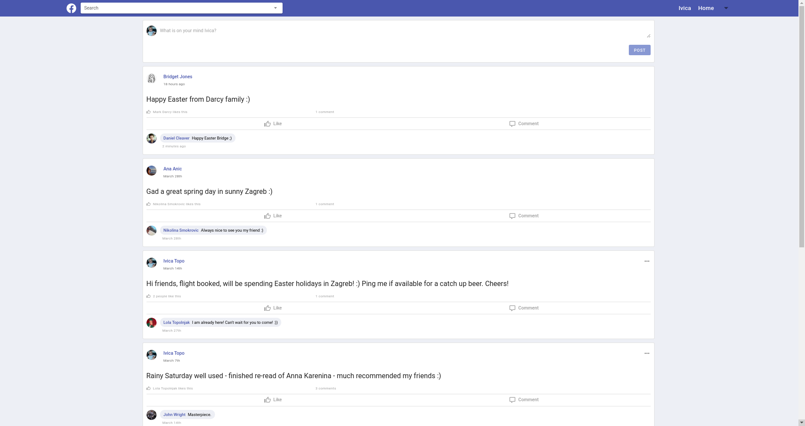
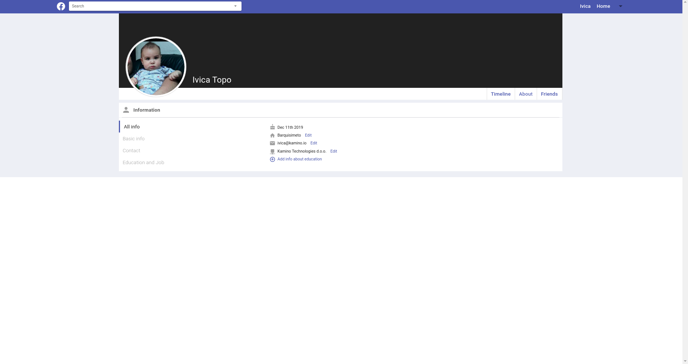

# Fakebook
Hi :) 

Fakebook is a simple version of Facebook. It is made as an exercise project on my way of becoming self taught frontend programmer. Here are some screenshots of the app.






## Project setup
```
npm install
```

### Compiles and hot-reloads for development
```
npm run serve
```

### Compiles and minifies for production
```
npm run build
```

### Lints and fixes files
```
npm run lint
```

### Customize configuration
See [Configuration Reference](https://cli.vuejs.org/config/).
